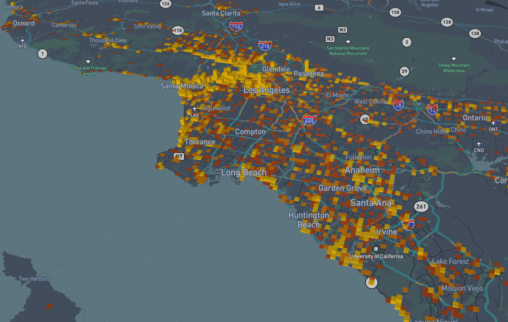

# Mission Dotlas 🌎

Part-Time Data Engineer Assessment

- [Mission Dotlas 🌎](#mission-dotlas-)
  - [Overview](#overview)
    - [About us](#about-us)
    - [The Mission](#the-mission)
  - [Getting started](#getting-started)
    - [Create a Private fork](#create-a-private-fork)
    - [Install Python `v3.9` or higher](#install-python-v39-or-higher)
    - [Install dependencies](#install-dependencies)
    - [Learning resources](#learning-resources)
  - [Evaluation](#evaluation)
    - [Submission](#submission)
    - [Criteria](#criteria)
    - [Contact](#contact)

## Overview

### About us

We at [Dotlas](https://dotlas.com) are building a suite of products for controlling, optimizing & growing retail businesses through AI-driven insights.

### The Mission

Your mission, should you choose to accept it, is to transform, process and analyze our dataset of **Restaurants in The State of California, USA**.

> For more details refer to [mission.ipynb](./mission.ipynb).

Here are a few maps to get you inspired!

<p align="center">
  
  <p align="center">Restaurants in California</p>
</p>

<p align="center">
  
  <p align="center">Restaurants in Los Angeles, grouped into <a href="https://www.youtube.com/watch?v=thOifuHs6eY">Hexagons</a> according to their Price Range</p>
</p>

<p align="center">
  
  <p align="center">Restaurants in Los Angeles, on a Grid, height indicates count</p>
</p>

<p align="center">
  
  <p align="center">Restaurants in San Francisco, according to their Dress Code, height indicates count</p>
</p>

<p align="center">
  <strong>We&#39;ve uploaded our dataset to an 
    <a href="https://studio.unfolded.ai/public/5b812aeb-8e2b-4530-bbca-ca14429bf03e">interactive map</a>
   on the Unfolded platform. Feel free to explore it.
  </strong>
</p>

<p align="center">
  
</p>

## Getting started

### Create a Private fork

Let's create a private fork of this repository:

- [Go to the Import a repository page on GitHub](https://github.com/new/import)
- Fill in the information as shown below:

  <p align="center">
    
    <p align="center">How to create a private fork</p>
  </p>

Once the repository is created on GitHub, clone it onto your local system!

### Install Python `v3.9` or higher

- You can download it from the [Python website](https://www.python.org/downloads/release/python-3105/)
- Or, you can install [Anaconda](https://www.anaconda.com/) and run the following command in your terminal:

  ```bash
  conda create --name dotlas python=3.9 -y
  conda activate dotlas
  ```

### Install dependencies

```bash
pip install -r requirements
```

> You may install any additional dependencies!

### Get crackin'!
Your mission's details are displayed in [mission.ipynb](./mission.ipynb).

### Learning resources

Please refer to [HELP.md](./HELP.md) for some resources to help you get acquainted with the tools you will need.

## Evaluation

### Submission

Once you're ready for evaluation, [invite us](#contact) as [private collaborators to your private fork](https://docs.github.com/en/account-and-profile/setting-up-and-managing-your-personal-account-on-github/managing-access-to-your-personal-repositories/inviting-collaborators-to-a-personal-repository)!

### Criteria

Submissions will be judged on:

- Readability & maintainability of code
- Correctness & approach to the solution
- Use of "best practices" by adhering to the [Pythonic way](https://towardsdatascience.com/how-to-be-pythonic-and-why-you-should-care-188d63a5037e)

### Contact

Feel free to reach out to us, should you have any questions.

| Name            | LinkedIn                               | GitHub                            |
| :-------------- | :------------------------------------- | :-------------------------------- |
| Eshwaran Venkat | https://linkedin.com/in/eshwaranv98/   | https://github.com/cricksmaidiene |
| Kelvin DeCosta  | https://linkedin.com/in/kelvindecosta/ | https://github.com/kelvindecosta  |

> Feel free to ping us anytime for support.

<p align="center">
  
  <p align="center"><strong>May the Force be with You!</strong></p>
</p>
