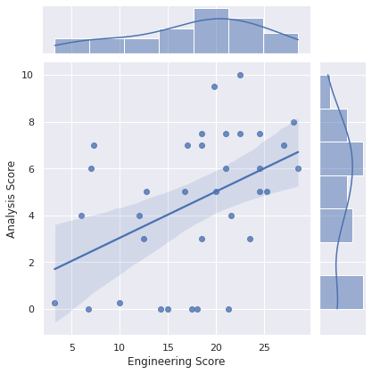

# Fall 2022

Fall 2022 saw the first iteration of the official Mission Dotlas notebook assignment. It tests a combination of data science and data engineering skills.

## Summary

* Total applicants: 1000+ ([Job Post](https://www.linkedin.com/jobs/view/3324942431))
  * The job post was made across multiple cyclical postings on LinkedIn, and the number of applicants is an estimate based on the total distinct applications received.
* Shortlisted candidates who were sent the assignment: 160
* Shortlisted candidates who successfully completed the assignment: 40
* Average time to submit assignment: 7 days
* Candidates who joined Dotlas: 2
* Test Average: 54.5%
* Test Max: 90%

## Feedback

Respondents: 27

> All respondents were shortlisted candidates who attempted the assignment. The feedback was collected through Google Forms prior to releasing the decision to the candidates, but after they completed the assignment.

* 60% of respondents found the assignment to be of higher-intermediate to advanced difficulty
* No candidates found the assignment extremely easy or extremely difficult
* 88% of the respondents found the help received during the assignment from the Dotlas team to be good or excellent.
* 92.6% of the respondents rated the Dotlas hiring process in the top two tiers on a 5-point scale, indicating a significantly more favorable experience compared to other companies they have applied to. All candidates rated the hiring process at least 3/5.

## Assignment Metrics

The assignment involved a total of 40 points spread between 30 points on data engineering exercises and 10 points on data science / analysis exercises. The following scatter chart plots candidate scores on the data engineering exercises against their scores on the data science exercises.

